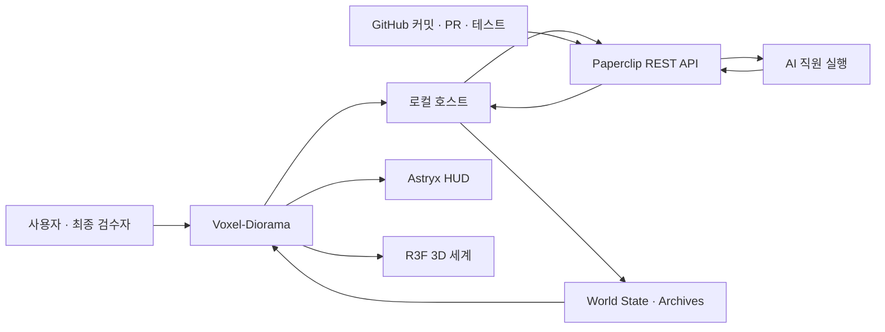

# Voxel-Diorama v0.3 — AI Workforce Island Master Plan

> **상태:** 첫 설계 동결  
> **문서 대상:** `/Users/rels/Documents/prep/Voxel-Diorama/PLAN.md`  
> **한 문장 정의:** 내가 AI 직원에게 맡기고 검수한 실제 업무가 국가별 3D 세계의 건물과 폐허로 영구히 남는 개인 운영 게임.

## 1. 제품 정의와 통합 판정

### 1.1 핵심 목표

개인 사용자가 [Paperclip](https://github.com/paperclipai/paperclip)의 AI 직원에게 실제 개발 업무를 맡기고, Voxel-Diorama에서 결과를 검수하며, 성공과 실패의 역사를 3D 섬으로 축적한다.

첫 성공 기준은 시각적 완성도가 아니라 다음 업무 루프의 반복 가능성이다.

1. 실제 개발 업무를 생성한다.
2. AI 직원이 수행하고 증거를 제출한다.
3. 사용자가 첫 시도를 반려해 폐허를 만든다.
4. 같은 업무를 재작업시킨다.
5. 재작업을 승인해 별도 부지에 건물을 완성한다.
6. 여행을 종료하고 섬을 보관한다.
7. 새 여행에서 다른 실제 업무를 다시 시작한다.

### 1.2 세 계획의 최종 판정

**채택**

- Paperclip을 업무·직원·실행·비용의 단일 원본으로 사용
- Astryx는 2D 업무 UI와 테마 토큰에만 사용
- React Three Fiber 기반 평면 아이소메트릭 섬
- 행성 → 테마/국가 → 스프린트 군도 구조
- Kenney CC0 원본 에셋 직접 사용
- 반려된 모든 시도의 영구 폐허
- 수정 요청과 반려를 구분
- 4단계 테마 전환: 마스크 → 해제 → 로드 → 공개
- 종료된 여행의 불변 스냅샷
- 폴링, 원자적 파일 저장, 반복 처리 방지

**수정**

- 브라우저가 Paperclip에 직접 연결하는 대신 단일 앱에 포함된 작은 로컬 호스트를 사용
- 런타임 스냅샷을 저장소의 `content/`가 아니라 macOS Application Support에 저장
- 고정 점수만 쓰지 않고 우선순위 점수에 실제 비용·시간 효율 보너스를 결합
- 행성 로비를 첫 구현에서 제외하고 핵심 업무 루프 검증 후 추가
- Kyoto 테마는 삭제 예정 묵업에서 가져오지 않고 새로 제작

**기각**

- 수동 건물 배치
- 반려할 때 새 Paperclip 티켓 생성
- 프로젝트와 국가의 1:1 고정 연결
- 기존 Japanese Temple Voxels 코드·이미지·복셀 모델 재사용
- GitHub Issues를 업무 원본으로 사용
- 별도 이벤트 소싱 계층
- 모노레포, 마이크로서비스, WebSocket 서버
- 초기 VoxelArtist 고용
- 구면 보행, 멀티플레이, HLS

---

## 2. 시스템 아키텍처와 핵심 규칙

### 2.1 책임 경계



- **Paperclip:** 회사, 프로젝트, AI 직원, 업무, 상태, 댓글, 실행 로그, 비용과 토큰
- **Voxel-Diorama:** 여행, 검수 UX, 배치 시도, 건물·폐허, 점수, 테마, 섬 보관
- **GitHub:** 커밋·diff·PR·테스트 등 검수 증거
- **사용자:** 승인, 반려, 예외 승인, 여행 종료의 유일한 권한자

Voxel-Diorama는 Paperclip 업무를 복제하는 두 번째 업무 시스템이 아니다. Paperclip 상태와 최소한의 세계 기록을 결합해 3D 세계로 투영한다.

### 2.2 최소 기술 구조

- Vite + React + TypeScript 단일 애플리케이션
- React Three Fiber + Three.js + Drei
- Astryx 버전은 lockfile에 고정
- 로컬 호스트가 정적 앱 제공, Paperclip 프록시, 세계 상태 저장을 함께 담당
- `127.0.0.1`에만 바인딩
- Paperclip 자격 증명은 브라우저에 전달하지 않음
- same-origin 요청과 `Origin` 검증 적용
- 앱이 보이는 동안 5초 폴링, 숨겨지면 중단
- 쓰기 작업 후 즉시 다시 조회
- 별도 DB, 메시지 큐, 이벤트 버스 없음

### 2.3 초기 AI 조직

초기 Paperclip 조직은 두 명만 둔다.

- **Technical Director:** 최상위 업무를 실행 가능한 하위 업무로 분해하고 Developer에게 배정
- **Developer:** 구현, 테스트, 증거 제출

AI 직원은 승인·반려, 여행 종료, 예산 변경, 기록 삭제 권한을 갖지 않는다. VoxelArtist는 핵심 루프가 통과하고 Kyoto 테마 제작을 시작할 때만 추가한다.

### 2.4 업무 구조

- Paperclip Company = 개인 AI 회사
- Paperclip Project = 실제 개발 프로젝트
- 여행 시작 시 Sprint Root Issue 생성
- 사용자가 발주한 결과물 업무 = Sprint Root의 직접 자식
- Technical Director가 만든 세부 작업 = 결과물 업무의 하위 업무

건물과 점수는 직접 자식인 결과물 업무에만 부여한다. 하위 작업 비용은 부모 결과물의 비용 요약에 포함하되 별도 건물이나 점수를 만들지 않아 중복 집계를 방지한다.

필수 업무 정보:

- 제목
- 목표와 배경
- 1~5개의 검증 가능한 완료 조건
- 우선순위
- 담당 AI 직원
- 마감일
- 저장소 또는 작업공간

### 2.5 상태와 세계 투영

| Paperclip 상태/행동 | 세계 표현 |
|---|---|
| `backlog`, `todo` | 미건설 부지 |
| `in_progress` | 공사 표식 |
| `in_review` | 자동 배치된 반투명 공사 건물 |
| Feedback | 같은 공사 건물 유지, 댓글만 전달 |
| Approve | Paperclip `done` + 완성 건물 |
| Reject | Paperclip `todo` + 현재 시도의 영구 폐허 |
| `blocked` | 경고 표식, 폐허 없음 |
| `cancelled` | 공사 표식 제거, 폐허 없음 |

규칙:

- `in_review` 최초 진입 시 열린 `PlacementAttempt` 하나를 만든다.
- 반복 폴링은 같은 시도를 중복 생성하지 않는다.
- Feedback은 반려가 아니며 폐허를 만들지 않는다.
- Reject에는 사유가 필수다.
- Reject 후 같은 Paperclip 업무를 재사용한다.
- 다시 `in_review`에 진입하면 시도 번호를 올리고 새 부지를 사용한다.
- 한 업무에는 여러 폐허가 있을 수 있지만 완성 건물은 최대 하나다.
- Paperclip UI에서 직접 `done`으로 변경된 업무는 건물을 자동 생성하지 않고 `needs_reconciliation`으로 표시한다.

### 2.6 자동 건물 배치

- 사용자는 건물 부지를 직접 선택하지 않는다.
- 건물 카탈로그 등급은 업무 우선순위로 결정한다.
- 실제 건물은 `issueId + attemptNumber`의 결정적 해시로 선택한다.
- 부지는 중앙에서 바깥쪽으로 도는 결정적 나선 순서의 첫 빈 셀을 사용한다.
- `in_review`에서 보인 공사 건물이 승인 시 같은 자리에서 완성된다.
- 반려 시 같은 자리에서 고정 폐허 자산으로 교체된다.
- 다음 시도는 다른 빈 부지를 사용한다.

### 2.7 점수

기본 점수:

| 우선순위 | 점수 |
|---|---:|
| Low | 15 |
| Medium | 30 |
| High | 45 |
| Critical | 60 |

효율 보너스:

- 같은 프로젝트와 우선순위의 승인된 과거 결과물 5개 이상부터 계산
- Paperclip 비용 요약은 해당 업무의 하위 작업을 포함
- 비용과 실행 시간의 과거 중앙값을 현재 값과 비교
- 두 값이 있으면 비율의 기하평균 사용
- 누락되거나 0 이하인 값은 제외
- 비교값이 없으면 보너스 0
- `bonusRate = clamp((efficiency - 1) × 0.2, 0, 0.2)`
- `finalPoints = base + round(base × bonusRate)`
- 페널티 없음, 최대 보너스 20%
- 섬 점수와 평생 누적 점수를 함께 표시
- 소비형 점수 경제는 만들지 않음

### 2.8 여행, 테마와 군도

- 한 번에 활성 여행은 하나
- 여행 시작 시 프로젝트와 테마를 선택
- 프로젝트와 국가/테마는 1:1로 고정하지 않음
- 한 여행이 시작되면 테마는 종료까지 변경 불가
- 최상위 결과물 업무가 모두 `done` 또는 `cancelled`일 때만 종료 가능
- 종료 시 불변 스냅샷 생성
- 보관된 섬은 선택한 테마 그룹의 군도에 배치
- `base` 테마는 Base Camp로 표시
- 국가 테마가 추가되면 해당 국가 군도에 스프린트 섬이 누적
- 행성 로비는 군도와 과거 섬을 선택하는 탐색 화면이며 보행 게임이 아님

---

## 3. 인터페이스, 저장과 콘텐츠

### 3.1 로컬 호스트 인터페이스

최소 엔드포인트:

- `GET /api/bootstrap` — 직원, 프로젝트, 활성 여행, 업무와 캐시 상태
- `POST /api/trips` — 여행 시작
- `POST /api/tasks` — 최상위 결과물 업무 생성
- `POST /api/tasks/:id/reviews` — `feedback`, `approve`, `reject`
- `POST /api/trips/:id/archive` — 여행 종료와 스냅샷 생성

모든 쓰기 요청은 idempotency key를 받는다. Paperclip 갱신 도중 앱이 종료되면 로컬 pending 기록과 Paperclip 현재 상태를 비교해 재시도하거나 조정 상태로 전환한다.

### 3.2 핵심 타입

- `Trip`: Paperclip 프로젝트·루트 업무, 테마, 기간, 상태
- `TaskProjection`: Paperclip 업무를 UI와 3D가 사용할 형태로 투영한 읽기 모델
- `PlacementAttempt`: 업무, 시도 번호, 부지, 건물, 결과
- `ReviewDecision`: feedback/approve/reject, 사유, 증거 예외, 처리 상태
- `ThemeManifest`: UI 토큰, 환경, 지형, 건물 등급, 공사 및 폐허 자산
- `TripArchive`: 종료 시점의 불변 섬 스냅샷
- `WorldState`: 활성 여행, 평생 점수, 아카이브 인덱스, pending 작업

외부 API와 로컬 JSON은 필요한 필드를 런타임에 검증한다. v0.1에서는 별도 범용 스키마 계층이나 코드 생성기를 만들지 않는다.

### 3.3 저장 위치

macOS Application Support 아래에 저장한다.

```text
Voxel-Diorama/
├── world-state.json
├── world-state.json.bak
└── archives/
    └── {tripId}.json
```

- 임시 파일 작성 후 원자적 rename
- 저장 전 직전 정상 상태 백업
- `schemaVersion` 필수
- 기존 archive ID 덮어쓰기 금지
- 알 수 없는 스키마 버전은 삭제하지 않고 읽기 전용 오류로 표시
- Paperclip 오프라인 시 마지막 정상 상태를 읽기 전용으로 표시
- Paperclip 업무 본문과 실행 로그는 중복 저장하지 않음

### 3.4 검수 증거

검수 패널은 다음을 함께 보여준다.

- 변경 요약
- 커밋, diff 또는 PR 링크
- 테스트와 실행 결과
- 알려진 위험 또는 미완료 항목
- Paperclip 실행 기록
- 비용, 토큰, 실행 시간

증거가 부족해도 사용자는 예외 사유를 적고 승인할 수 있다.

### 3.5 에셋 정책

- [Task Arcade](https://github.com/wineforyourplate/task-arcade)는 게임 규칙 참고 자료로만 사용
- Task Arcade 코드나 에셋 파일을 복사하지 않음
- 기본 3D 에셋은 [Kenney](https://kenney.nl/assets)에서 직접 다운로드
- Kenney 게임 에셋은 CC0이며 상업적 사용과 수정이 가능하고 표기는 선택 사항
- 팩 이름, 버전과 URL만 `ASSETS.md`에 기록
- Kenney 로고는 사용하지 않음
- 삭제할 Japanese Temple Voxels 브랜치에서 어떤 자산도 가져오지 않음
- Kyoto 테마는 Kenney, MagicPixel, GPT Image, MagicaVoxel/Blender 등을 이용해 새로 제작
- 테마에 없는 역할은 `base` 카탈로그로 fallback

### 3.6 테마 전환

1. Astryx UI가 CSS 기반 전환 마스크를 표시
2. 이전 테마의 GLB, 텍스처, 재질, InstancedMesh를 dispose
3. 새 manifest와 3D 자산을 로드하고 UI 토큰을 적용
4. 3D 장면과 Astryx UI를 동시에 공개

로드에 실패하면 `base` 테마로 복구한다. `prefers-reduced-motion`에서는 전환 시간을 줄이고 붕괴 애니메이션을 단순 교체로 대체한다.

---

## 4. 구현 로드맵

### Phase 0 — 기준선 정리

- 저장소 루트 `/Users/rels/Documents/prep`에서 작업 상태 확인
- `main`으로 전환
- 사용자 결정에 따라 `plan/japanese-temple-voxels` 로컬·원격 브랜치 삭제
- 해당 브랜치의 15개 미푸시 커밋도 폐기
- 별도 내용이 섞인 `stash@{0}`은 적용하거나 삭제하지 않음
- `main`에서 새 구현 브랜치 생성
- 이 설계 동결본을 `Voxel-Diorama/PLAN.md`에 저장

**완료 기준:** 묵업이 새 앱의 코드·자산·역사적 기반으로 사용되지 않는다.

### Phase 1 — Paperclip 재설치와 API 검증

- 실행 프로세스, 기본 데이터 경로, 사용자 지정 `PAPERCLIP_HOME` 재확인
- 사용자 지정 데이터가 발견되면 삭제하지 않고 백업 후 중단
- 최신 안정 릴리스로 로컬 재설치
- Technical Director와 Developer 재고용
- 업무 생성, 배정, 상태, 댓글, 비용 요약 API 검증
- 실제 응답 fixture를 저장해 이후 투영 테스트에 사용

**완료 기준:** Paperclip UI에서 실제 개발 업무 하나를 생성·배정하고 비용 및 실행 상태를 읽을 수 있다.

### Phase 2 — Fast-Fail 2D 운영 루프

- 로컬 호스트와 Paperclip 어댑터 구현
- Astryx로 업무 생성, 목록, 검수, 증거 패널 구현
- feedback/approve/reject 전체 흐름 연결
- 원자적 world-state 저장과 pending 조정 구현
- 이 단계까지는 Paperclip UI로 프로젝트 개발을 부트스트랩
- 새 앱에서 업무 생성과 검수가 가능해지면 일상 운영권을 전환

**완료 기준:** 3D 없이 실제 Paperclip 업무를 생성하고 feedback·반려·승인할 수 있다.

### Phase 3 — Greybox 3D 핵심 루프

- R3F 고정 아이소메트릭 섬과 이동·확대 구현
- 우선순위별 회색 건물과 폐허 프리미티브 사용
- 상태 투영, 자동 배치, 시도 기록 구현
- 승인 상승 애니메이션과 반려 붕괴 프리셋 각 1종
- 반복 폴링과 재시작 중복 방지
- 점수와 효율 보너스 구현

**완료 기준:** 같은 실제 업무에서 폐허 하나와 별도 완성 건물 하나를 남긴다.

### Phase 4 — Kenney Base Camp

- 필요한 Kenney 3D 팩을 원본에서 선정
- 건물 등급, 공사, 폐허, 지형 역할에 매핑
- 프리미티브를 Kenney 자산으로 교체
- 고정 아이소메트릭 카메라에서 가독성 조정
- 오브젝트 100개 성능 검증

**완료 기준:** 핵심 업무 루프가 최종에 가까운 기본 자산으로 작동한다.

### Phase 5 — Kyoto 테마

- 삭제 묵업과 독립적인 Kyoto 아트 바이블 작성
- 새로운 Kyoto 자산과 Astryx 녹색·대나무 토큰 제작
- ThemeManifest와 base fallback 연결
- 4단계 테마 전환과 실패 복구 구현
- 핵심 루프 통과 후 VoxelArtist 추가 여부 판단

**완료 기준:** Base Camp와 Kyoto 사이를 열 번 전환해도 GPU·메모리 사용량이 지속 증가하지 않는다.

### Phase 6 — 행성 로비와 군도 아카이브

- 여행 종료 조건과 불변 archive 생성
- Base Camp 및 국가별 군도 구성
- 현재 섬과 과거 섬 선택
- 보관된 검수 사유, 점수와 증거 링크 열람
- 새 여행은 빈 섬에서 시작

**완료 기준:** 종료한 섬을 다시 열어 당시 건물·폐허·검수 기록을 동일하게 확인할 수 있다.

---

## 5. 검증, 위험과 제외 범위

### 5.1 자동 검증

- 모든 Paperclip 상태와 세계 표현 매핑
- feedback이 폐허를 만들지 않음
- reject가 같은 업무를 `todo`로 되돌리고 폐허를 만듦
- 다음 `in_review`가 새 시도와 새 부지를 사용
- 중복 폴링·중복 요청·재시작 안전성
- 승인 도중 부분 실패 조정
- 직접 `done` 변경의 reconciliation
- 점수 데이터 부족, 누락, 0값과 20% 상한
- 원자적 저장과 백업 복구
- archive 덮어쓰기 방지
- 테마 누락 자산 fallback과 자원 dispose

### 5.2 수동 최종 시나리오

1. Voxel-Diorama 개발 업무를 생성한다.
2. Technical Director가 분해하고 Developer가 수행한다.
3. 테스트 증거를 확인하고 feedback을 한 번 보낸다.
4. 개선되지 않은 제출을 reject해 폐허를 만든다.
5. 같은 업무의 재작업을 approve해 새 부지의 건물을 완성한다.
6. 여행을 종료하고 행성에서 보관된 섬을 다시 연다.
7. 새 여행에서 두 번째 실제 업무를 시작한다.

### 5.3 품질 기준

- 사용자 Mac에서 3D 오브젝트 100개 기준 60fps 목표
- 부족하면 그림자·후처리·장식 밀도를 먼저 줄임
- 키보드로 업무 생성과 검수 가능
- 명암 대비, 포커스 표시, reduced motion 지원
- Paperclip 오프라인 상태에서 데이터 손상이나 쓰기 시도 없음
- 모든 단계는 해당 완료 기준과 인간 검수를 통과해야 다음 단계로 이동

### 5.4 주요 위험과 대응

| 위험 | 대응 |
|---|---|
| Paperclip API 변경 | 모든 호출을 한 어댑터에 제한하고 안정 버전 고정 |
| Paperclip과 세계 상태 불일치 | idempotency key, pending 기록, reconciliation 화면 |
| 3D가 업무보다 먼저 커짐 | 2D 운영 루프와 greybox E2E를 선행 |
| 영구 기록 손상 | 원자적 저장, 백업, archive 불변성 |
| 테마 메모리 누수 | 단일 테마 로드와 10회 전환 검사 |
| 에셋 스타일 불일치 | base 카탈로그 역할 고정, 국가별 아트 바이블 |
| AI 결과 품질 저하 | 인간 전용 승인과 증거 체크리스트 |

### 5.5 명시적 제외

- Japanese Temple Voxels 묵업 재사용
- Task Arcade 코드 복사
- Slack 지시
- GitHub Issues 업무 원본화
- 수동 건물 배치
- 새 티켓을 만드는 반려 방식
- 프로젝트와 국가의 1:1 고정
- 멀티플레이와 관전자
- 구면 보행과 BVH
- 자유 궤도 카메라
- 물리 기반 파편
- WebSocket 실시간 동기화
- HLS 음악
- 점수 소비 경제
- 원격 배포
- 한국·그리스 등 추가 국가 테마

### 5.6 확정된 기본값

- 단일 사용자, 로컬 Mac
- 새 Astryx + 3D 앱이 일상 운영 화면
- Paperclip UI는 설치·조직·예산·감사용
- Paperclip이 업무와 실행의 단일 원본
- 사용자가 유일한 최종 검수자
- 초기 직원은 Technical Director와 Developer
- 한 번에 활성 여행 하나
- 테마는 여행마다 선택하고 종료까지 고정
- 건물 배치는 자동·결정적
- 반려는 같은 업무의 새 시도로 이어짐
- 모든 반려 시도는 영구 폐허
- Base Camp로 핵심 루프를 먼저 증명한 뒤 Kyoto와 행성을 추가
- 이 문서 이후 구현자가 선택해야 할 열린 설계 결정은 없음
