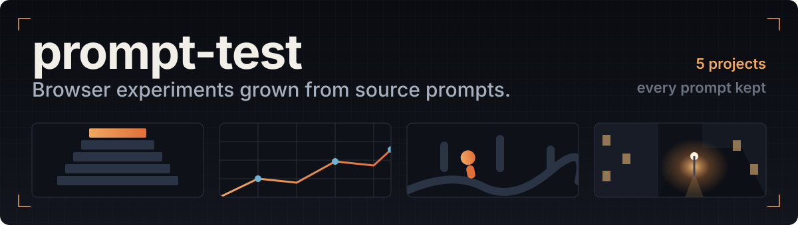

<p align="center">
  
</p>

<p align="center">
  <strong>One prompt in. A running thing out. The prompt stays in the folder so you can judge both.</strong>
</p>

<p align="center">
  <a href="./night-street">night-street</a> ·
  <a href="./call-guys">call-guys</a> ·
  <a href="./empires-rts">empires-rts</a> ·
  <a href="./infra-diorama">infra-diorama</a>
</p>

---

These are not portfolio pieces and they are not tidy. Each folder is what happened
when a single prompt was taken seriously for longer than a prompt usually is —
run, looked at, disagreed with, measured, and rebuilt until it held up. The brief
that started it is kept beside the result in `PROMPT.md`, unedited, so the gap
between what was asked for and what shipped is visible rather than narrated.

Everything here runs in a browser. No engine, no asset store, no build server.

<br>


### 🌃 [night-street](./night-street)

A first-person walk down one procedurally generated city block at 21:00.

Every texture, mesh, light and sound is generated in code — no images, no models,
no audio files. The interesting part is not the street, it is the loop that built
it: a blind visual critic, an `experiments.tsv` log with one change per row kept
or discarded on a number, layout invariants enforced as node tests, and dev routes
that measure GPU frame time, edge crawl and how much of the frame is empty.

`Three.js` · `Vite` · `TypeScript`

### 🏃 [call-guys](./call-guys)

**Wobble Rush 3D** — a single-player obstacle course.

Five stages across four game types (race, hunt, survival, final) and six
characters. Ships with a browser test page that checks every level against six
fairness rules and then plays each one with a scripted bot, so a level that
cannot be beaten fails loudly instead of quietly.

`Three.js` · `plain HTML/CSS/JS`

### ⚔️ [empires-rts](./empires-rts)

**Dominions 2100** — a browser-playable RTS spanning 1800 to 2100.

Economy, construction, combat, opposing AI and fog of war, with the whole span of
three centuries reachable in one session.

`Three.js` · `Vite` · `JavaScript`

### 🏗️ [infra-diorama](./infra-diorama)

A dark B2B scrolling story that walks through a five-stage construction process.

Scroll-driven staging built to hold together as one continuous scene rather than
as a stack of separate sections.

`React` · `React Three Fiber` · `GSAP` · `Lenis`

<br>


```bash
cd prompt-test/<project>
npm install
npm run dev
```

Then open the URL it prints. `night-street` also has `npm run check`, which runs
its type check, its build, and the node tests that guard the street layout.

<br>


Each project keeps its original brief in `PROMPT.md`. It is not updated to match
what was built — that would defeat the point. Where the result deviates from the
brief, the reason is written down in the project's own README or working notes.

The habit that made the most difference, and the one worth stealing: **do not
trust a prompt, and do not trust a screenshot either.** Build the smallest test
that can tell you which of two explanations is true, run the baseline twice
before believing a change, and treat an impossible measurement as a broken
instrument rather than a discovery.

<br>

<sub>Part of <a href="https://github.com/Hejin0-0/ai-playground">ai-playground</a>.</sub>
