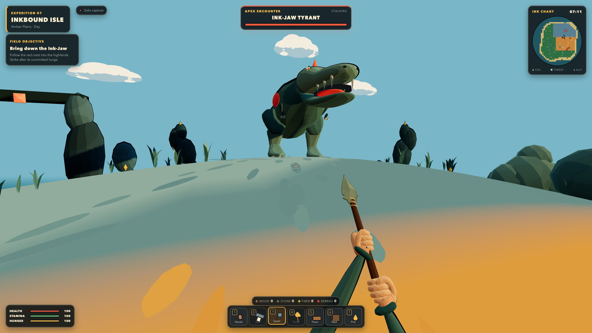

# Inkbound Isle



A browser-playable first-person dinosaur-survival expedition. The island, foliage, dinosaurs, structures, effects, clouds, stars, audio, and UI accents are generated from code at runtime—there are no downloaded art, texture, or audio assets.

The source briefs are preserved in [`PROMPT.md`](./PROMPT.md). The implementation
and its measured departures from the requested AAA target are documented below
rather than rewriting the prompt to match the result.

## Run

```bash
npm install
npm run dev
```

Open `http://localhost:4173`. The session relay runs on `4174`; other devices on the same LAN can join through `http://<host-ip>:4173` when both ports are reachable.

`npm run preview` serves the production bundle as a solo visual preview. Use `npm run dev` for the shared session.

## Controls

| Input | Action |
|---|---|
| `W A S D` | Move |
| Mouse | Look |
| `Shift` | Sprint |
| `Space` | Jump |
| `E` or left click | Gather, strike, or place |
| `F` / `T` | Feed a nearby Mosscrest |
| `R` | Order a bonded Mosscrest to follow/stay |
| `1–4` | Hands, axe, spear, torch |
| `5–7` | Foundation, wall, campfire |
| `Q` | Rotate a placement |
| `X` | Dismantle an owned structure |
| `C` / `Tab` | Open crafting |
| `G` | Eat a berry |
| `M` | Mute/unmute |

## Included Expedition

- Seeded open island with jungle, plains, coastline, cool highlands, 1,055 instanced details, and two landmarks
- Gather/craft/build/survival loop with useful food, camp warmth, torch, rotation, collision rejection, and bounded dismantle refunds
- Three-feed parasaur bonding, follow/stay commands, companion attacks, a hostile raptor pack, and a telegraphed apex encounter
- Ordered objectives, death/respawn, day/night, local auto-save/Continue, and a scored victory screen
- First-person tools, head-bob, sprint sway, damage kick, hit-stop, illustrated trails, and capped procedural Web Audio
- Minimal dark/amber HUD, hotbar, minimap, encounter bars, native settings, reduced motion, fullscreen, and accessible menu states
- Local/LAN session co-op sharing player presence plus bounded gather, build, and creature events, with disconnect cleanup and reconnect

## Quality Checks

```bash
npm run check
npm run smoke:session # run while npm run dev is active
```

`npm run smoke:browser` additionally verifies real rendering, responsive HUD, keyboard crafting, a rotated foundation placement, bonding/commands, and live hostile combat. It needs an existing Playwright Core installation (`INKBOUND_PLAYWRIGHT_MODULE` may point to it) and Chrome (`INKBOUND_CHROME` may override its path). `INKBOUND_BASE_URL` selects the local test server. Each scenario uses isolated browser state; test fixtures never replace a normal expedition or save.

Current v23 evidence: 170/170 tests and production build pass; exact JavaScript gzip is 183,388/184,320 bytes; the 12-scenario Chrome matrix and LAN session smoke pass with zero browser diagnostics; two High-quality runs measured 7.93–7.98 ms mean, 269 calls, and 123,744 triangles. Round 22 unanimously preferred v23's two context-scaled hit effects, but its 48 median and visible blockers keep the visual gate open.

Technical checks and visual acceptance are separate. The current polish pass has not met its locked visual gate: three independent reviewers must prefer each asset family with a median of at least 90/100 and no blocker. Recent blind reviews still identify prototype-level anatomy, grips, and coastal materials. Older 87-point reviews describe a historical checkpoint, not the current release assessment. Current evidence and retained/rejected comparisons are recorded in [`docs/QA-REPORT.md`](./docs/QA-REPORT.md), [`docs/LOOP6-REVIEW.md`](./docs/LOOP6-REVIEW.md), and [`docs/LOOP-LEDGER.md`](./docs/LOOP-LEDGER.md).

## Scope

This is a playable local/LAN vertical slice under active visual revision, not a commercial AAA release or a Steam submission package. Hosted matchmaking, accounts, adversarial anti-cheat/server authority, platform SDKs, localization, production animation rigs, and a large content catalog remain production milestones.
